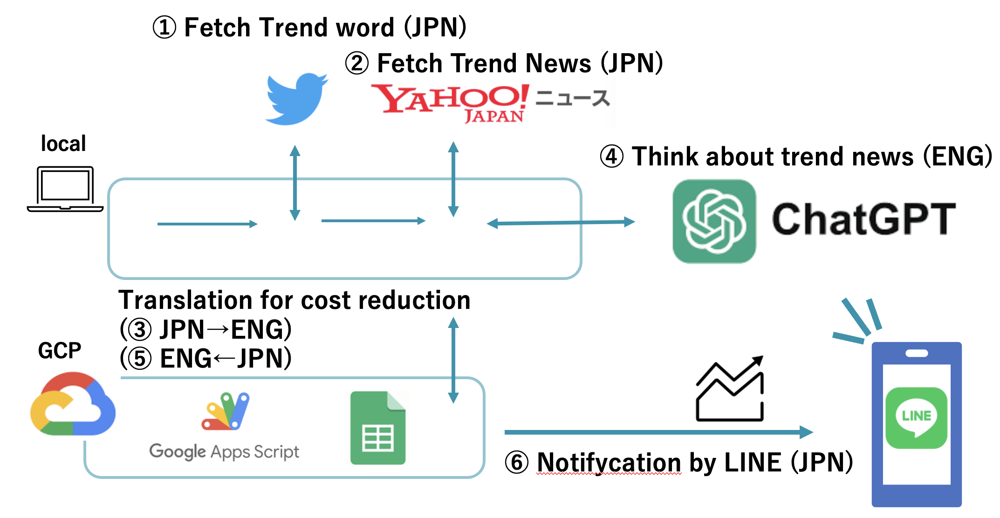
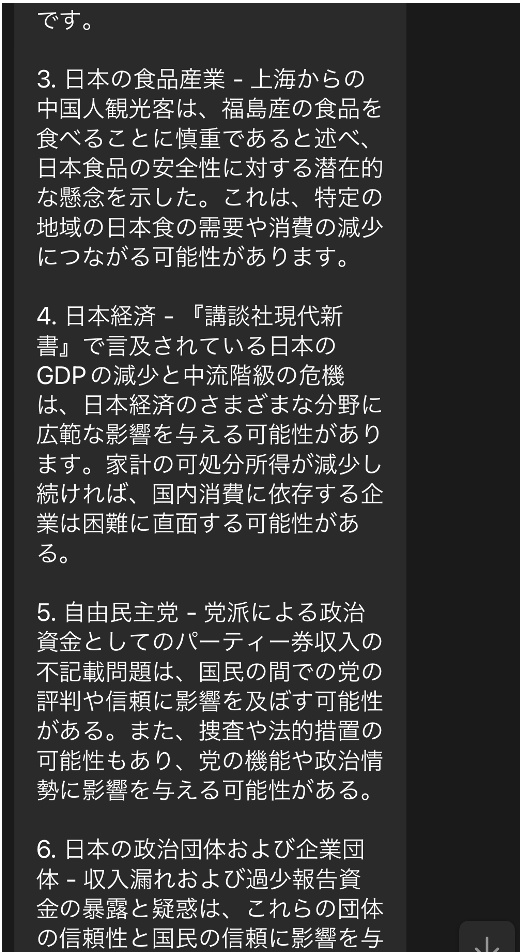
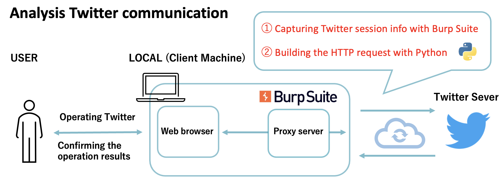

# News Analysis with Chat GPT API

## Project Overview

This project utilizes Python, Google App Script, and the Chat GPT API to analyze news content. Specifically, it uses session information during login to fetch trending information from Twitter and retrieves related articles from Yahoo News. Subsequently, these articles are input into ChatGPT to infer potential impacts on the economy.

## Technology Stack

- Python
- JavaScript (Google App Script)
- Burp Suite (Monitoring tool for network traffic)

## Implemented Features

1. Sending HTTP requests to obtain top trending words from Twitter’s news tab.

   > **Note**: Since Twitter has changed to "X", the terms regarding web scraping may have been altered. Ensure to review the terms before cloning the code.
   >
   > **URL**: [https://twitter.com/robots.txt](https://twitter.com/robots.txt)

2. Searching trending words on Yahoo Japan News, outputting top article contents in text, and saving them to a local CSV file.

   > **Note**: The structure of Yahoo News sites may change over time.

3. Utilizing the Chat GPT API to answer queries about news data, distributing responses via a LINE bot.

   > **Note**: Using the Chat GPT API in English tends to be cheaper than in Japanese. Therefore, news data is translated into English using Google Cloud Platform, following the steps below:
   >
   > 1. Transfer the CSV file to a cloud-based Google Drive Spreadsheet.
   > 2. Translate the text data written in the spreadsheet using Google App Script.
   > 3. Formulate a query for the Chat GPT API to infer the economic impact based on the English-based news.
   > 4. Deliver the response using LINE Notify to LINE.

### Process Diagram

### Behavior

### Main Class Structure

#### 1. CSVEditor Class

Provides functionalities for reading and writing CSV files. It includes methods for adding new content to a CSV file (**`write_to_csv`**), clearing the content of a CSV file (**`clear_csv`**), and reading content from a CSV file (**`read_from_csv`**).

#### 2. ConfigManager Class

Used to load Twitter API configuration information from the configuration file (**`sns_settings.ini`**). This includes authentication tokens and header information.

#### 3. TwTrendsFetcher Class

Class used to fetch current trends using the Twitter API. Trends are obtained through the **`fetch_trends`** method.

#### 4. YahooNewsFetcher Class

Class used to fetch articles from Yahoo News based on trending words. The **`fetch_yahoo_news_links_and_titles`** method retrieves news links and titles based on search queries, while the **`fetch_article_text_from_json`** method retrieves the text of news articles.

#### 5. NewsQueryAssistant Class

Class used to send questions based on Yahoo News data to ChatGPT and receive responses. The **`process_queries`** method reads news data and user questions, poses questions to ChatGPT, and processes the responses.

### Usage

1. Prepare necessary packages and configuration files.
2. Before running the script, set up Twitter API settings in **`sns_settings.ini`**, Google API authentication details in **`support_account_key.json`**, and set up the Chat GPT API key. For Twitter authentication details, use monitoring tools like Burp Suite to capture session information during login. For Google API, set up an

 account through GCP.

### Development Environment

- Mac OS M1 Sonoma 14.11
- Python 3.11.4
- pip 23.3.2
- Versions of each module can be referred to in pipversion.txt
